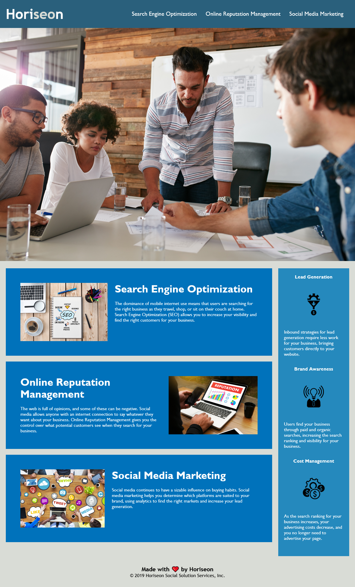

# Module 1 Challenge

## Description

In this challenge I was tasked with refactoring the given code (HTML and CSS). The goals were to make it accessible using semantics and alt text for images as well as consolidating redundant CSS. I was also able to fix some bugs like a broken link leading to the Search Engine Optimization content card.

What did I get out of this Challenge?

- I learned about the importance of accessibility
- I learned about the necessity of clean code/reducing redundancy
- I practiced writing descriptive comments

## Usage

The site is available at the following link: https://jakubcic.github.io/horiseon-site/index.html

 

